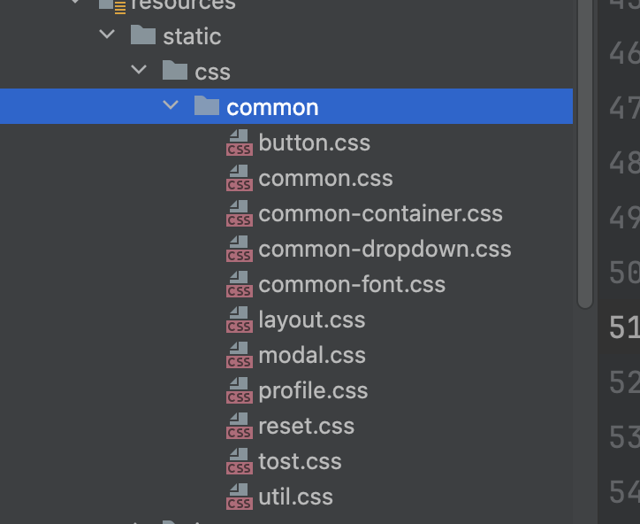
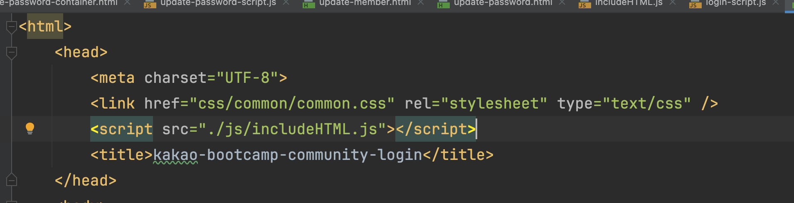

# 시간
- 12:00 ~ 24:30 카카오 테크 부트캠프 3주차 과제

# 간략 회고

### 카카오 테크 부트캠프 3주차 과제

카카오 테크 부트캠프 3주차 과제 페이지를 총 4개 제작하였다.

어제 1개를 구현하였으니 오늘은 3개를 구현한 것이다.

어제는 html을 클린코드하게 작성하려고 하였다. 덕분에 개발 생산성이 높아졌다. :)

오늘은 한번 css를 클린코드하게 작성하려고 해보았다.

저번에 개인 프로젝트를 bootstrap을 이용하여 제작한 적이 있다.

boostrap은 단순히 css 파일 하나만 불러온다. 그리고 bootstrap이 정의한 대로 class 속성을 태그에 적용하면

깔끔하게 컴포넌트들이 배치된다.

여기서 영감을 얻어 나도 css 라이브러리를 만들면 후에 개인 프로젝트 생산성에 도움이 될 것이라고 생각하였다.

초반엔 바로 만드는 것이 쉽지 않아 페이지 4개를 모두 제작하였다.

그 후에 4개 페이지 중 겹치는 css를 찾고 그것을 모듈화 하여 제작하였다.

다음과 같이 관련된 css 파일을 모으고
@import를 사용하여 common.css에 모든 css 파일을 모았다.

이제 페이지를 제작할때 common.css를 불러오고 나의 라이브러리가 정의한 대로 class 속성을 부여하면 깔끔하게 웹페이지가 작성된다.

